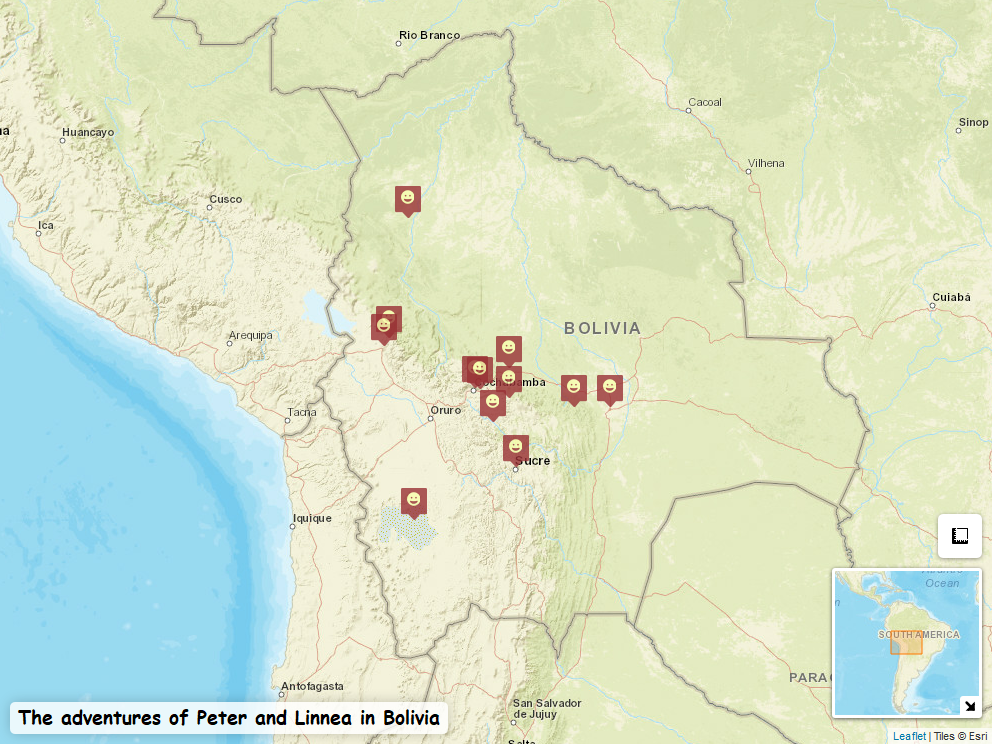
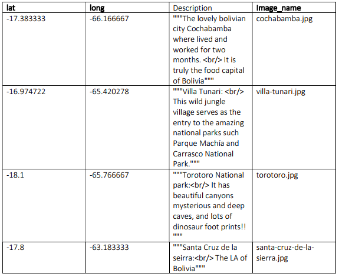

```{r, message=FALSE,echo=FALSE}
knitr::opts_chunk$set(message = FALSE, echo=F,warning=F)
library(tidyverse,knitr)
```
## Cultural Data Science and Spatial Analytics

This is a repository for our exam project for the Spatial analytics 2021 course for Cultural Data Science 2020/2021 electoral program at Aarhus University

### Contact

You can get in touch with us on these emails: peter.thramkrongart@gmail.com or kuba.raszka12@gmail.com

### License

Distributed under the MIT License. See ```LICENSE``` for more information.


### Welcome!

Firstly, we are glad that you decided to give a shot to our map-maker tool to create some nice and flashy travel maps. This tutorial aims to explain what data format our shiny (Chang et al., 2021) app expects and how to easily gather data from your pre-Covid trips if you don’t happen to have such data lying around in your computer.  To give some context, first, we will briefly review what a geographic coordinate system is and how a decimal degree format (DD) differs from the degrees-minutes-seconds system (DMS). We will also explain what the projected coordinate system is and how it works hand in hand with the geographic coordinate system. Then we will explain how to create a dataset compatible with our app without any spatial or programming knowledge. There are many and more ways how to create make one but we will focus primarily on using Wikipedia/Geohack, and Open Street Map.



Map created with the Travel Map Maker

### Geographic coordinate system (GCS)

A geographic coordinate system (GCS), also a datum, is a system for assigning a unique value to every single point of the Earth’s surface. As the Earth is far from a smooth and regular sphere, there are multiple models which depict the Earth slightly differently. Fortunately, we can leave pondering about which one is the best one for cartographers. Nearly all map coordinates you have ever encountered were derived from the GCS called  World Geodetic System 1984 (WGS84, WGS 1984, ESPG 4326). Unsurprisingly, the app’s map engine Leaflet (Cheng et al., 2021) expects the coordinates to be derived from this GCS.

The WGS84 uses longitudes and latitudes for describing a position relative to the center of the Earth. Longitudes are lines connecting poles that carry east-west information ranging from -180 to +180. Latitudes are in turn lines depicting the angle between the equator and a given location. Meaning, they are the lines parallel to the equator. They carry north-south information and consequently range from 0 to 90 (Smith, 2020). You can see both longitude and latitude in the picture below: 
 

 (Betts, 2021)

Not only are there are different GCSs but one system can also be written in different formats. They are two primarily used formats - Decimal Degrees (DD) and degrees-minutes-seconds (DMS). The DMS expresses the information in degrees, minutes, and seconds. Similarly, the DD stores the information in degrees but minutes and seconds are in decimal fractions. Analogically, when talking about time, you can express 90 minutes as a 1,5h (DM) or 1h and 30’ (DMS).
Let´s take Dhaka, the capital of Bangladesh as an example. In the DD format, the coordinates are 23°43′44″ N, 90°23′40″ E, meaning the capital is located at the 23° degrees, 43 minutes and 44 seconds in the northern hemisphere, and 90° degrees, 23 minutes, 40 seconds in the east globe. In the DD format, the coordinates are 23.728889, 90.394444. 

### Projected coordinate system

If we want to move from pure 3D models and pure geographic coordinates to maps, we need a way to convert a 3D model to a flat map. That’s where a projected coordinate system (PCS) comes into play. It essentially enables flattening the Earth into a 2D representation. Such a transformation comes at some price. Every projection slightly differs in the degree and type of distortion (e.g., area, shape, distance, …) that it inevitably inflicts upon the map. The app uses a default projection of the leaflet package (Cheng et al., 2021) called Google Mercator also known as Web Mercator or EPSG:3857 (Smith, 2020). 

The Web Mercator projection comes from a larger “Mercator” family which has been used for navigation since the 16th  century. Although it enables one to view the entire world, the projection disproportionately increases continents’ size as it goes further from the equator and closer to the poles. You can see it yourself by zooming out in the app and comparing the size of Greenland and Africa. They seem to be of the same size but, in reality, Africa is 14 times larger (Chakravarty, 2017). This is caused by all longitudes being parallel, thus they cannot come together and create poles. Consequently, the Web Mercator can map areas only within the  0-85° latitude range. Everything outside the limit will be simply mapped around the 85° threshold. We don’t view this as a major problem because we expect that whoever visited one of the poles is probably using a match more advanced tool for recording his or her journeys anyway😊

Of course, there are better-suited types of projections for a travel map, like Robinson or Winkel Tripe projections. Unfortunately, we were unable to incorporate them into our map while keeping different map layers. Therefore, we have decided to rather stick with the Mercator Web despite its obvious limitations.
Most map and coordinate sources output coordinate in GSW1984, unless you work with a historical or very special map. It would probably work even then but your locations would be slightly mislocated. Although the projected coordinate system is important only for mapping coordinates, you can see in the example of Web Mercator and its latitude limit that it is good to know what projection one is working with. Now, equipped with some knowledge, we can move to gather your data.

### How to create the Data

Open an editor of your choice which is suitable for text and numeric input and can output the file with .txt or .csv extension (Excel, OpenRefine, a notepad, …).  The app also supports several separators (comma, semicolon, space, tab) that can be chosen when uploading the data in the app. The dataset should contain 3 columns:
-	A fixed column name “lat” – a value of latitude coordinate (-90 to 90, in fact, it is -85° to 85°, see the section above for the explanation)
-	Fixed column name “long” – a value of longitude coordinate (-180 to 180)
-	A customizable column name for a label - a name of the place or any note you would like to pop up as a label at the location; 

By default, the labels of the label column will be treated as individual text strings. This restricts the text to a single line per label. To combat this, you can render the labels as HTML to format the text as you like. HTML requires some expertise, so we will just give you some quick tips: You can add line breaks by adding ```<br/>``` where you want the breaks, and you can surround text with ```<b>``` to make it bold. To make the app render you labels as HTML check the “Render Labels as HTML” checkbox in the “Markers” dropdown menu. In any case, we recommend that you wrap your texts in triple quotes ```"""text"""``` to allow for the most freedom when writing them. This avoids most problems with separators and so on. For more HTML options, we refer to the following sources: [Leaflet tutorial](https://rstudio.github.io/leaflet/popups.html) and [W3school](https://www.w3schools.com/html/html_formatting.asp). 

Every location needs to be in a separate row. Once you have a list of places in the column with a choosable name, you can find the coordinates in most web or phone maps. We recommend adhering to either Wikipedia or Open Street Map. Also, if you use a simple notepad, you need to choose the separator yourself and be consistent with it. Remember, unless you put the chosen separator into quotation marks, the sign will always be recognized as a separator which can in case of space or comma cause troubles. 

__Wikipedia and GeoHack:__    

1. Search for your desired location in [Wikipedia](https://en.wikipedia.org/wiki/Main_Page). Click on the coordinate in the right upper corner of Wikipedia, it will direct you to [Geohack](https://geohack.toolforge.org/) 
3. Choose the format you prefer (we recommend the decimal degree format as it less susceptible to errors when copying and pasting)
4. Copy the first coordinate into “lat” column
5. Copy the second coordinate into “long” column

__Alternatively, you can obtain the coordinates from Open Street Map:__

1. Find your desired location in [Open Street Map](https://geohack.toolforge.org/)
2. Right-click on it and select view address
3. Copy the first number into “lat” column
4. Copy the second number into “long” column
  
__Make sure that:__

- All your coordinates in one file are either in DMS or DD format, not both
- You put longitudes and latitudes in the correct column. That is usually problem number one if the coordinates do not correspond to the place.
  
### Images

There is also a possibility to include an image for every location. You can do so by creating the fourth column:

- A fixed column name “Image_name” – a full picture name for a given location, e.g., bali_paradise.png

Also, note that __the image option is all or nothing__. If you decide to include images, then you need a picture for every listed destination because a pictureless destination will be automatically dropped. In terms of an image format, the app can work with all major formats, such as .png, .jpg, .jpeg.
You can see below a demo dataset with the optional 4th column for images. Note, that the __columns  names in bold must be the same__ as in this example.




### Running the App

Assuming you have cloned our github repository, you use the app by running ```runApp('Travel_map_maker')``` from the R console. But first ensure that you have a list of these packages installed in the specific version. We cannot guarantee that it will work with different versions.

The list of packages and their versions:
```{r, echo = F}
Packages = c(
  "colourpicker",
  "fontawesome",
  "leaflet",
  "leafpop",
  "mapview",
  "shiny",
  "shinyalert",
  "shinythemes",
  "shinyWidgets",
  "sp",
  "tidyverse",
  "varhandle"
)

Versions <-  c(
  "1.1.0",
  "0.2.0",
  "2.0.4.1",
  "0.0.6",
  "2.9.0",
  "1.6.0",
  "2.0.0.9001",
  "1.2.0",
  "0.6.0",
  "1.4-5",
  "1.3.0",
  "2.0.5"
)

tibble(Packages,Versions) %>% knitr::kable()
```

### Data Interaction with the App

We structured the app’s functionality into 4 parts: uploading and optionally conversing data, customizing marker and icon features, customizing the title of the map, choosing map layout, and downloading the map. Now, we will walk you step by step through the app.

In the upload section, you can import your .csv or .txt file. If the data has a different separator than a comma, which is the app’s default, you will be prompted with a message to change it. You can see in the data table if all columns are collapsed into one. If so, then you have also a wrong separator but you can easily eyeball the right one. If you have your coordinates in decimal degree (DD) format, then you can safely go on. But if the file has DMS coordinates, then you will be warned that a conversion is needed. You can do it in the DMS Conversion Options by first specifying the right separators based on your data shown under the map and then checking the DMS box.

If you can see the map with markers, then you can skip the following step. If you cannot, then your column name for a pop-up label is not aligned with the app’s default “Description”. You can fix it by typing your column name for labels into the “Label column” window under Upload Data. 

Lastly, you can optionally upload images as well. Note that if you choose to do so, then every location entry must have an image and just one, otherwise the app will not work. The hard work should be done and now you can play around with markers’ features and the map’s title which are rather self-explanatory. 

Also, in the right upper corner of the map, there are 11 map layouts each emphasizing and conveying slightly different information, e.g., satellite images, terrain, roads, and more. A tool for measuring distances within the map is right above the minimap in the lower right corner of the map. When zooming out completely, the size of the map shrinks a lot, you can avoid that by clicking the “extend the edges of the map”. Lastly, you can export your creation either as a static PNG file with all your changes and zoom level saved. Or you can export it as a stand-alone HTML file which keeps the full interactivity. 

We hope that you enjoyed the process of making your travel map and also learned that cartography does not have to always be dry and dull. 

If you made it all the way here, then you either scrolled down or created a map. If the latter, then we hope that you will find a use for your new map and learned something new about coordinate systems and maps.


### References

Betts, J. (2021). Latitude vs. Longitude: Differences in Simple Terms. YourDictionary. https://examples.yourdictionary.com/latitude-vs-longitude-differences-simple-terms

Chang, W., Cheng, J., Allaire, J., Sievert, C., Schloerke, B., Xie, Y., Allen, J., McPherson, J., Dipert, A., & Borges, B. (2021). shiny: Web application framework for r [Manual]. https://CRAN.R-project.org/package=shiny

Chakravarty, S. (2017, May 19). Maps that show why some countries are not as big as they look. Geospatial World. https://www.geospatialworld.net/blogs/maps-that-show-why-some-countries-are-not-as-big-as-they-look/

Cheng, J., Karambelkar, B., & Xie, Y. (2021). leaflet: Create interactive web maps with the JavaScript “leaflet” library [Manual]. https://CRAN.R-project.org/package=leaflet

Smith, H. (2020, February 27). Geographic vs Projected Coordinate Systems. ArcGIS Blog. https://www.esri.com/arcgis-blog/products/arcgis-pro/mapping/gcs_vs_pcs/

