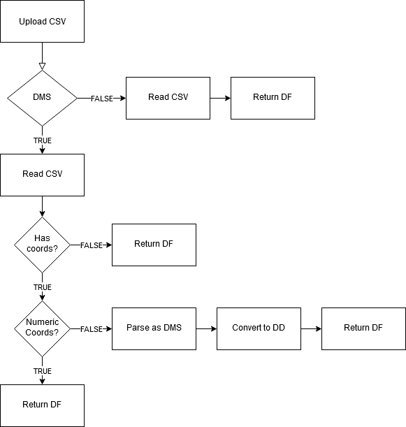
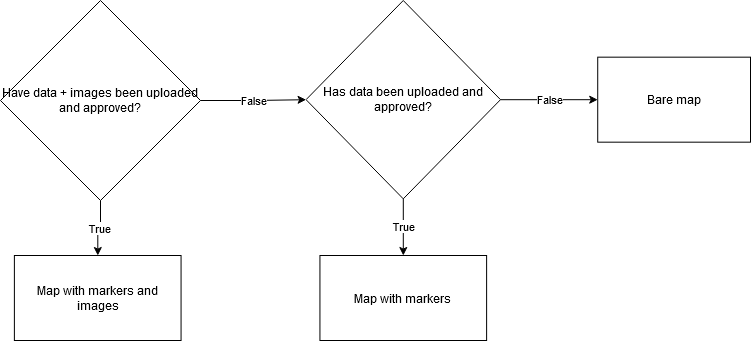

## 5 Implementation

Our project is based on two core libraries: _shiny_ and _leaflet_. Both are tools that are fairly easy to implement for R-novices and both provide powerful and robust functionality. Shiny is an R-based tool for building interactive web-applications. Its main strength is that it is controlled by the R Programming language. This means that all our code can be written in a couple of R-scripts. Similarly, _Leaflet_ allows us to create interactive maps with a few lines of R code. In both cases, interactivity is key: Users need an interactive web-app to intuitively be able to create informative and good maps without too much expertise. In terms of novice map making, we find interactivity that interactivity enhances the user experience dramatically. Using the _web mercator_ projection allows user to plot point data from all over the world at the same time, and the interactivity allows multiple levels of granularity and detail. For a travel map, user may plot multiple points in the cities they visits, and the may plot cities on multiple continents. We, therefore, find that leaflet provides the most functionality relevant to novices in a way that is very easy to use. If needed, novice R-user will easily be able to adopt the code we used for mapping for other projects. If, were to make static maps instead, _ggplot2_ + _ggmap_ [@kahle_ggmap_2013; @wickham_ggplot2_2016] and _tmap_ [@tennekes_tmap_2018] would have been great candidates. Both have use easy to learn syntax, and both are very powerful. Tmap actually, uses Leaflet for its interactive mapping functionality. So does, the beginner-friendly _mapview_ package[@appelhans_mapview_2020]. We, therefore, chose go to closer to the source and use the leaflet R-package.

Shiny apps consists of two main elements. A user interface (UI) script and and a server script. The scripts can be combined to one, but it will still consist of the two elements. The UI.R script is very similar to a markup script. It essentially, controls the layout and design of the app. The UI script is were we make and place the controls that the user can interact with such as checkboxes and upload/download buttons. The server.R script contains all th logic for the creation of the map, the handling of the downloaded data, the popup messages, the creation of the table and so on. The server has reactive elements that dynamically change as the user interact with controls of the UI. E.g. the user can choose different seperator values to parse the dataset, and the reactive data variable changes accordingly. Similarly, the server has observing objects such the monitoring error message popups that waits for the user to upload data or trigger the diagnosis button.

Because the app has many reactive objects, such as the map that changes depending on the dataset, we had to implement several measures to handle errors and avoid the app crashing. This turned out be a much bigger feat than we anticipated, and it will be a general theme throughout this project. The main problems arise the second the user uploads the tabulated data. If something goes wrong in the uploaded, the effects will trickle down to the reactive objects relying on the data format being correct. The expects two columns named *lat* and *long* to be the coordinates in DD. If columns does not exist, we still want to return the dataframe so  that the user can access the data via the table in the app to debug the problem. We offer the option of converting the coordinates provided in the DMS-format to DD. If the user checks the DMS-conversion checkbox, the app will attempt to convert the coordinates to DD. But two conditions need to be met. First, it verifies presence of the the *lat* and long columns and, secondly, it checks whether they are in numeric format. Otherwise, the conversion would fail. We have created a flow chart that describes the main logic of the data upload. 



When the data is uploaded an observing error checker object is triggered. It checks that the provided data is in the right format, and attempts to diagnose some of the most commen errors, should they arise. It first checks that it has the coordinate columns. If they do not exist, it assumes that the data has been parsed with the wrong seperator. Next it ensures that all coordinates are numeric. Then it checks that the latitude and longitude within the proper ranges. Lastly, it ensures that a column with the name provided for the label column exist. If all is approved, the user will be given an popup message that informs the user that data has been succesfully uploaded and approved. Otherwise the error checker will provide the user with an appropriate error popup of the error highest in the logic tree. The code for the error functions has been attached below.


```{r, eval= F}

error_check <- function(df, label_col) {
  len = length(df[, 1])
  
  if (!sum(c("lat", "long") %in% colnames(df)) == 2) {
    alert(title = "Separator Error !!",
          text = "It seems that you have chosen a wrong seperator. You see can the dataset below the map and choose a corresponding separator.",
          type = "error")
    
  }
  else if (!sum(check.numeric(df$long) + check.numeric(df$lat)) == len * 2) {
    alert(title = "Longitude or Latitude Class Error !!",
          text = "It seems that some of your values in the long or lat columns are not numeric. Double check their formats.",
          type = "warning")
  }
  else if (!sum(df$long <= 180 & df$long >= -180) == len) {
    alert(title = "Longitude Error !!",
          text = "It seems that your long column contains a value outside of the allowed range for longitude (-180 - 180). Ensure that all values are within the range.",
          type = "error")
  }
  
  else if (!sum(df$lat <= 90 & df$lat >= -90) == len) {
    alert(title = "Latitude Error !!",
          text = "It seems that your lat column contains a value outside of the allowed range for latitude (-90 - 90). More often that not, this is caused by flipping long and lat columns. Ensure that all values are within the range.",
          type = "error")
  }
  else if (ncol(select_if(df, names(df) %in% label_col)) != 1) {
    alert(title = "Label Error !!",
          text = "It seems that your column name for labelling/describing locations does not correspond to the default: Description. You can change it in the Upload options in the Label name box.",
          type = "error")
  }
  else {
    alert(title = "Success !!",
          text = "Your data is loaded in the right format, now you can customize the aesthetics!",
          type = "success")
  }
}

```

Ideally, we want to show a map at all times in the app. The map should reflect what valid data it has available. We start by defining the base map, that does not have any positional markers. We shows this map if no data has been uploaded yet.
The map has selectable tile layers provided by Esri (CITATION NEEDED), a customizable title, a minimap, and a measuring tool. Below is the the code used for defining the base map. when we call input$SOMETHING, we refer to customizable variables available to the user such as the title and its color.

```{r, eval = F}
#initiate map
start_map <- leaflet()
#grab all esri tile layers
esri <- grep("^Esri", providers, value = TRUE)
#add esri tile layers
for (provider in esri) {
  start_map <-
    start_map %>%
    addProviderTiles(provider,
                     group = provider,
                     options = providerTileOptions(noWrap = !input$wrap_map))
}

#use html code to format the title
map_title <-
  paste(
    "<b style='color:",
    input$title_color,
    ";font-size:",
    input$title_size
    ,
    "px;font-family:Comic Sans MS'>",
    #Comic Sans FTW
    input$map_title
    ,
    "<b/>",
    sep = ""
  )

#create the basic map without data
plot <- start_map %>%
  #add layer selector
  addLayersControl(baseGroups = names(esri),
                   options = layersControlOptions(collapsed = T))  %>%
  #add minimap
  addMiniMap(tiles = esri[[1]],
             toggleDisplay = TRUE,
             position = "bottomright") %>%
  #add measuring tool
  addMeasure(
    position = "bottomright",
    primaryLengthUnit = "meters",
    primaryAreaUnit = "sqmeters",
    activeColor = "#3D535D",
    completedColor = "#7D4479"
  ) %>%
  #add title
  addControl(map_title, "bottomleft")

```

To avoid crashing the app by attempting to define a map with bad coordinates or something similar, we have implemented a logic switching system that only maps coordinates when they have been approved and only attempts to add images when they have been uploaded. The logic follows the fowchart below:





```{r, eval = F}
  #reactive value for approving the data format
  format_approved <- reactive ({
    if (is.null(input$file1)) {
      return ()
    }
    df = filedata()
    len = length(df[, 1])
    #format requirements
    if (sum(c("lat", "long", input$description) %in% colnames(df)) == 3 &
        sum(check.numeric(df$long) + check.numeric(df$lat)) == len * 2 &
        sum(df$long <= 180 &
            df$long >= -180) == len &
        sum(df$lat <= 90 & df$lat >= -90) == len) {
      TRUE
    }
    else {
      FALSE
    }
  })

```

## References